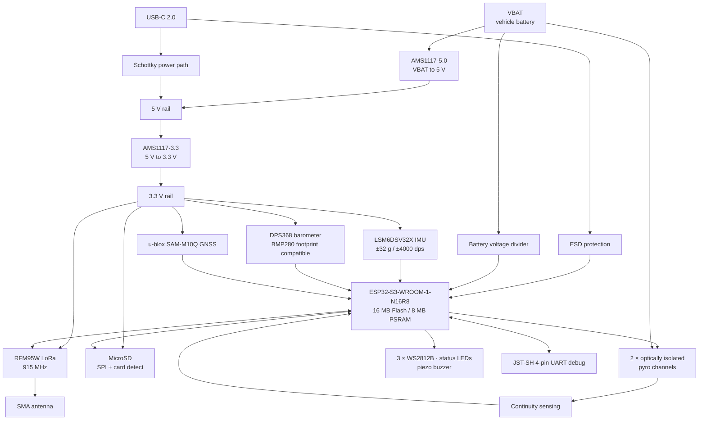

# IGNIS v5 Flight Computer
### Ignitia Rocket Lab · Tecnológico de Monterrey GDL

---

## What is this?

IGNIS v5 is the fifth revision of Ignitia Rocket Lab's SRAD (Student Researched and Developed)
flight computer, a general-purpose avionics platform for high-power student rockets.

It handles the full flight from liftoff to recovery: sensor fusion, apogee detection,
pyrotechnic deployment, real-time LoRa telemetry, GNSS tracking and flight data logging.
Apogee is detected in flight rather than pre-programmed, so the same board can fly
missions from 500 m to 3 km without hardware changes.

---

## Competitions

IGNIS is used in the competitions Ignitia Rocket Lab takes part in or plans to join:

| Competition | Name | Location |
|---|---|---|
| **IREC** | Intercollegiate Rocket Engineering Competition, Spaceport America Cup | New Mexico, USA |
| **LASC** | Latin American Space Challenge | Brazil |
| **ENMICE** | Encuentro Mexicano de Ingeniería en Cohetería Experimental | Mexico |

---

## What's New in v5

v5 includes the lessons from the bench tests, flight tests and design reviews of the
previous versions. **All the areas of opportunity identified in earlier revisions have been solved**:

- **Reliability:** improved USB-C, power and pyro circuits.
- **Sensors:** updated IMU and barometer with a wider measurement range.
- **Manufacturability:** all assembled parts are available for **assembly at JLCPCB**, with alternates available in Mexico.
- **Documentation:** consistent schematic sheets and net names, and a BOM ready for assembly.

---

## Hardware at a Glance

| Block | Component |
|---|---|
| MCU | ESP32-S3-WROOM-1-N16R8 · 16 MB Flash / 8 MB PSRAM |
| RF Telemetry | RFM95W · 915 MHz LoRa · SMA antenna port |
| GNSS | u-blox SAM-M10Q · integrated patch antenna |
| IMU | LSM6DSV32X · 6-DOF · ±32 g / ±4000 dps |
| Barometer | Infineon DPS368 *(BMP280 drop-in compatible)* |
| Storage | MicroSD · SPI · card detect |
| Power | Dual AMS1117 · VBAT → 5 V → 3.3 V · battery voltage monitoring |
| USB | USB-C 2.0 · ESD protected · native USB programming |
| Debug | JST-SH 4-pin UART |
| Pyro | 2 channels, optically isolated MOSFET deployment with continuity sensing |
| Indicators | 3× WS2812B RGB · status LEDs · piezo buzzer |
| PCB | 4-layer · Altium Designer · JLCPCB fabrication and assembly |
| Apogee range | Adaptive, real-time apogee detection · 500 m to 3 km rockets |

---

## System Architecture



---

## Project Structure

```
IGNIS-v5-FlightComputer/
├── Schematics/
│   ├── Main.SchDoc
│   ├── Power.SchDoc
│   ├── RF_LoRa_&_GPS.SchDoc
│   ├── Sensors.SchDoc
│   ├── Storage.SchDoc
│   ├── Indicators.SchDoc
│   └── Pyros.SchDoc
├── PCB/
│   └── IGNIS_v5.PcbDoc
├── Libraries/
├── BOM/
└── Fabrication/
```

---

## Design & Development

**Lead Designer & Author:** [Emilio Guadarrama](https://github.com/Emilio-Guadarrama)  
Vice President, Ignitia Rocket Lab · Avionics & Electronics Lead

**Pyro Circuit:** Aristoteles Prieto  
**Team President:** Maximiliano Funoy Serrano  
**Faculty Advisor:** Dr. José Luis Henríquez Mercado

## Team

**Ignitia Rocket Lab**  
Tecnológico de Monterrey, Campus Guadalajara

📧 ignitia.rocketlab@gmail.com

---

## License

This project is open source under the [MIT License](LICENSE). You are free to use, modify and
share the design, including for your own rockets, as long as the original copyright notice is kept.

---

**Contact the author:** Emilio Guadarrama · [emilio.guadarrama@outlook.com](mailto:emilio.guadarrama@outlook.com)
